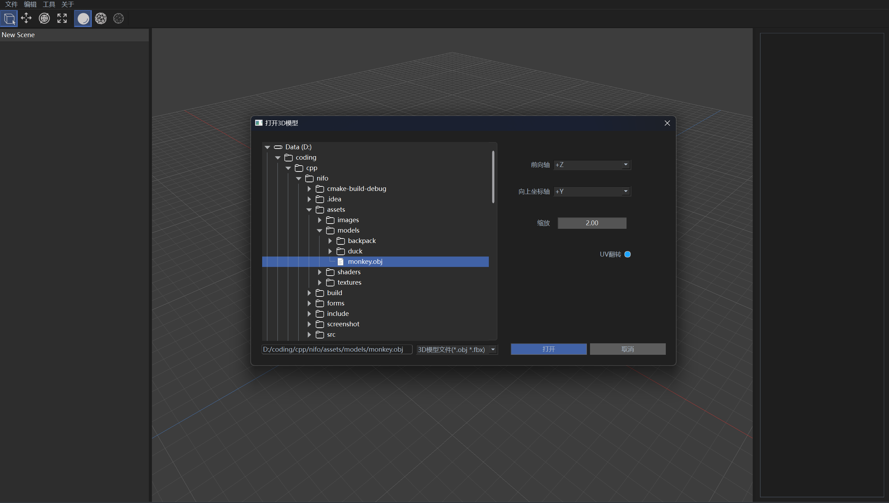
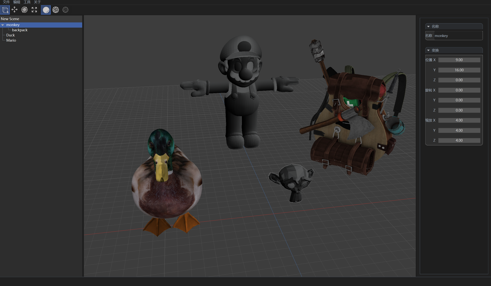
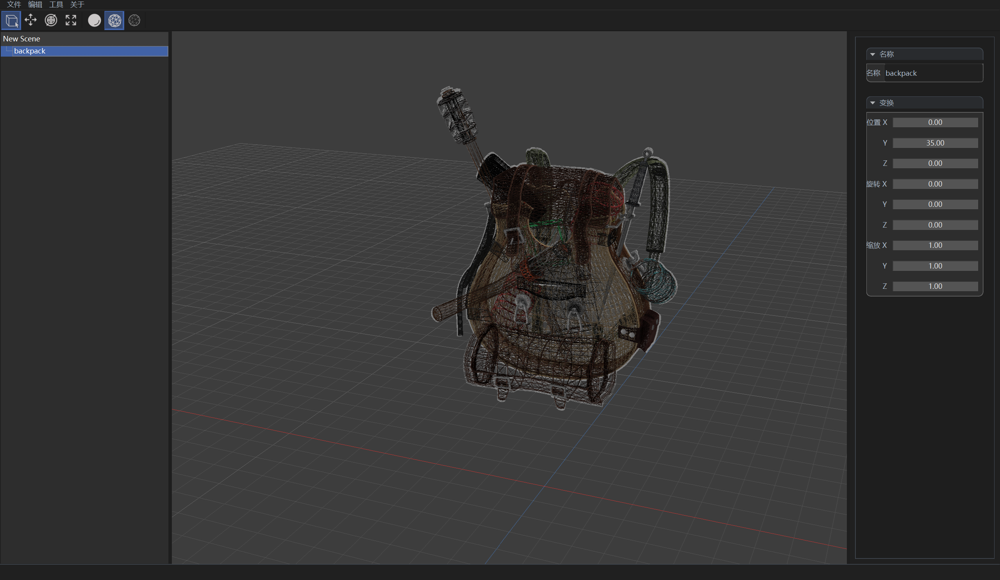

# Nifo 3D模型查看器

Nifo 是一款使用 Qt6 与 C++20 编写的 3D模型查看器  


[](https://opensource.org/licenses/MIT)
[](https://isocpp.org/)
[](https://en.wikipedia.org/wiki/C%2B%2B20)
---
要求显卡驱动支持OpenGL 4.5  

Nifo仍处于开发中, 目前已实现的功能:
* 模型导入
* 场景树
* 物体属性编辑
* 物体选择
* Phong、Blinn-Phong光照
* MRT

一些功能的预览:  

  

  

  

---

## 构建 Nifo
请确保你安装Qt6并且环境变量Qt6_DIR已设置好(Qt6_DIR是你所使用的Qt工具集下的lib目录下的cmake目录, 例如D:/Qt/6.7.0/msvc2019_64/lib/cmake)

该项目的依赖其它第三方库由[vcpkg](https://github.com/Microsoft/vcpkg)管理, 如果你没有vcpkg请先获取它
```shell
git clone https://github.com/Microsoft/vcpkg.git
```

使用CMake构建该项目(其中%VCPKG_ROOT%表示你的vcpkg的安装目录)
```shell
cmake -S . -B build -DCMAKE_TOOLCHAIN_FILE=%VCPKG_ROOT%/scripts/buildsystems/vcpkg.cmake

cmake --build build
```

---

## Nifo的EAP(Early Access Program)

[Nifo-EAP](EAP/x64-windows/nifo.zip)

---

## License

Nifo is released under the [MIT](https://opensource.org/licenses/MIT) license. See LICENSE file.